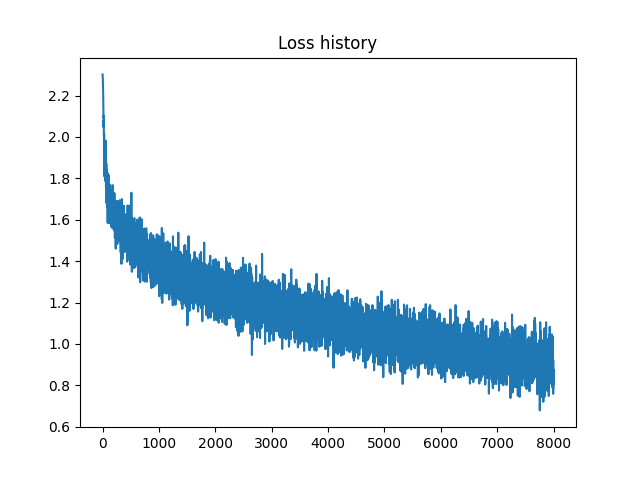

# Batch normalization and Dropout. Advanced optimization.  
datetime: 2023-10-27 03:39:47  
Well done in: 235 seconds  
learning_rate = 0.005  
reg = 0.2  
num_iters = 8000  
batch_size = 256  

Final loss: 0.9167302184741281   
Train accuracy: 0.69226   
Test accuracy: 0.5077  

